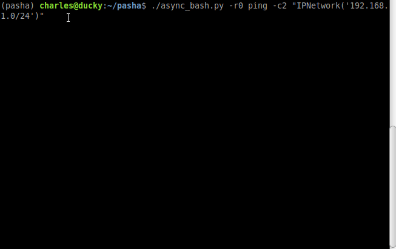

# pasha
Python 3 Async shell Accelerated.
The aim of this repository is to share python3 scripts to increase shell productivity.
Currently only one script is available but I have some other scripts ideas ;)

## async_bash.py
This script allow to write a shell command line integrating one to many python iterators.
The script will evaluates these iterators, collect all the commands, run them asynchronously and show the result using a json format.



### Usage
```
usage: async_bash.py [-h] [-s [SEMAPHORE]] [-r [RETURNCODE]] ...

positional arguments:
  command_line

optional arguments:
  -h, --help            show this help message and exit
  -s [SEMAPHORE], --semaphore [SEMAPHORE]
                        Number of commands to execute at the same time
  -r [RETURNCODE], --returncode [RETURNCODE]
                        Only show output for the selected returncode
```

* The semaphore option allow to choose the number of shell process running in parallel (100 by default)
* The returncode option allow to show only success "-r0" or any error code you want

In the command line, each python iterators should be separated with a space and placed between quotes simple or double and you can use the other type of quotes to declare string values. Lists, list comprehension and any iterators can be used.

When running, the script will show in stderr a summary of the progress.

### Examples
```
./async_bash.py sleep "range(1, 10)"
```
No utility except showing how it works.

```
./async_bash.py grep "['error', 'warning']" "['/var/log/messages{}'.format(x) for x in ['', '.1']]"
```
Show an example using two iterators

### Special python functions or classes

* The IPNetwork class is imported from the netaddr package as it can be used as an Iterator for IP Addresses.
Example : Try 2 icmp requests to each ip of the 192.168.1.0/24 network and only display success :
```
./async_bash.py -r0 ping -c2 "IPNetwork('192.168.1.0/24')"
```

* The bash(command) special function allow to get the stdout of a bash command
Example : cat every file of a folder
```
./async_bash.py cat "bash('ls')"
```

* The load_json(filename) do json.load() on the file descriptor of the filename
Example : toto.json contains ["1", "2"]
```
./async_bash.py echo "load_json('toto.json')"
```
will display
```
{
    "echo 2": {
        "returncode": 0,
        "stdout": [
            "2",
            ""
        ],
        "stderr": [
            ""
        ]
    },
    "echo 1": {
        "returncode": 0,
        "stdout": [
            "1",
            ""
        ],
        "stderr": [
            ""
        ]
    }
}
```


### Requirements
```
netaddr==0.7.19
termcolor==1.1.0
```
* netaddr for IPNetwork class
* termcolor for colored success and failures during progress
